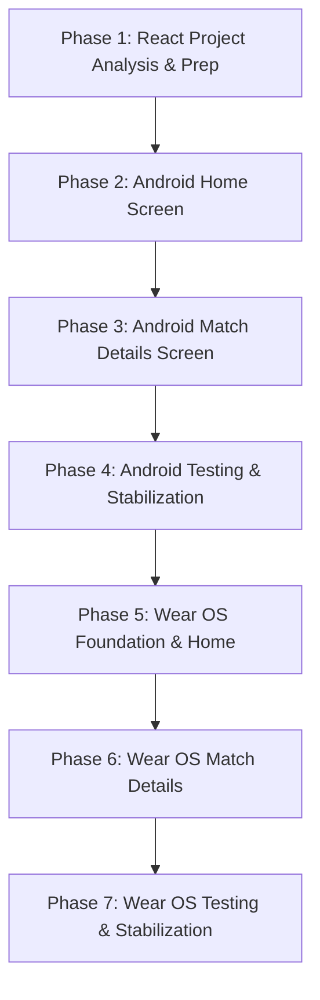

# Android & Wear OS Implementation Plan: Jcricket

## 1. Executive Summary

**Jcricket** is a real-time cricket scores mobile and wearable application designed for personal use. It acts as a thin client consuming a custom, pre-existing backend API that handles the extraction and formatting of raw cricket provider data. 

This document outlines the migration and implementation strategy from a complete, functional React reference application (`cricket-scores-web`) to:
1. A **Native Android Application** built using **Kotlin, Jetpack Compose, and Material 3**.
2. An **Independent Native Wear OS Application** built using **Wear Compose and Wear Material 3**.

The primary objective is to maintain feature and aesthetic parity with the React application, ensuring a modern, dark-themed, and responsive experience while avoiding over-engineering and enterprise-style complexity.

---

## 2. React Reference Application Analysis

### 2.1 Application Structure

The React application is structured as a lightweight Single Page Application (SPA). It manages routing and view transitions internally using React State, which simplifies navigation by rendering conditional views.

```
cricket-scores-web/
├── src/
│   ├── api/
│   │   └── matches.js          # API client for backend communication
│   ├── assets/                 # Static assets
│   ├── components/             # UI Components
│   │   ├── MatchCard.jsx       # Card element representing a match on the dashboard
│   │   ├── MatchCard.css       # Styles for MatchCard
│   │   ├── MatchDetails.jsx    # Coordinator for the detailed match view
│   │   ├── MatchDetails.css    # Layout styles for MatchDetails
│   │   └── details/            # Subcomponents for Match Details
│   │       ├── BatterStatsTable.jsx
│   │       ├── BowlerStatsTable.jsx
│   │       ├── CommentarySection.jsx
│   │       ├── MatchInfoCard.jsx
│   │       ├── RecentBallsList.jsx
│   │       ├── ScoreSummaryCard.jsx
│   │       ├── UdrsDetailsCard.jsx
│   │       └── details.css     # Shared styling rules for detail components
│   ├── utils/
│   │   └── format.js           # Date formatting utility
│   ├── App.jsx                 # Application entry, state manager, and routing logic
│   ├── App.css                 # Base layouts, dark theme tokens, and spinners
│   ├── index.css               # Global CSS resets and custom properties
│   └── main.jsx                # DOM entry point
```

#### Shared Components & Utilities
*   **Routing**: Handled in [App.jsx](file:///Users/jayanthbharadwajm/development/cricket-scores-web/src/App.jsx) via `selectedMatch` state. If it is null, the match grid is rendered. If populated, it renders `<MatchDetails>` with a back callback.
*   **State & Sync Management**: The app uses automatic intervals to poll the backend:
    *   **Dashboard view**: Refreshes the match list every **15 seconds** when no match is selected.
    *   **Active Match details view**: Refreshes the details page every **10 seconds** if the match status is live (`"In Progress"` or `"Innings Break"`).
    *   **Timestamp Tick**: Forces a component refresh every **10 seconds** to recalculate human-readable timestamps (e.g., "Synced 15s ago").
*   **Utilities**: [format.js](file:///Users/jayanthbharadwajm/development/cricket-scores-web/src/utils/format.js) formats timestamps into localized date strings (e.g., `Sat, Jun 20, 07:31 PM`).

### 2.2 Screen Inventory

| Screen | Purpose | Data Source | User Interactions | Navigation Paths |
| :--- | :--- | :--- | :--- | :--- |
| **Home (Dashboard)** | Overview of all cricket matches (Live, Preview, Finished) | `GET /matches` | • Select a card to view details<br>• Pull-to-refresh or tap refresh icon | • To Match Details (upon card selection) |
| **Match Details** | Comprehensive details of a selected match | `GET /matches/:matchId` | • Go back to dashboard<br>• Tap refresh icon | • To Home (via back button) |

### 2.3 Component Inventory (Match Details Screen)

| Component | Responsibility | Inputs (Props) | Dependencies |
| :--- | :--- | :--- | :--- |
| `MatchCard` | Dashboard match summary, live indicator, status/score | `match` (object), `onClick` | `formatStartDate` |
| `MatchInfoCard` | Meta details: series name, format, venue, teams, date, toss result | `matchInfo` (object) | None |
| `ScoreSummaryCard` | Live status, batting team score/overs, run-rates, partnerships, last wicket | `live` (object), `status` (string) | None |
| `RecentBallsList` | Displays badges for the latest deliveries in the current over | `recentBalls` (array) | Dynamic CSS badge utility |
| `BatterStatsTable` | Table of runs, balls, boundaries, and strike rates for the active batters | `striker` (object), `nonStriker` (object) | None |
| `BowlerStatsTable` | Table of overs, maidens, runs, wickets, and economy for active bowlers | `bowlerStriker` (object), `bowlerNonStriker` (object) | None |
| `UdrsDetailsCard` | UDRS review metrics remaining, successful, and unsuccessful for both teams | `matchUdrs` (object), `team1`, `team2` | None |
| `CommentarySection` | Displays chronological match commentary with events highlighted | `commentary` (array) | Event CSS badge utility |

### 2.4 Detailed View Analysis

#### 2.4.1 Home Screen
*   **Layout**: Header bar containing the title and refresh button with a relative "Synced X ago" timestamp. Matches are arranged in a responsive grid (1 column on mobile, 2 on tablet, 3 on desktop).
*   **Match Cards**: Shows the format, series name, status badge, team logos, names, scores, and status text.
*   **State Handling**:
    *   **Loading**: Renders a loading spinner with "Fetching matches...".
    *   **Refreshing**: A linear animation runs along the bottom of the header while background network calls are active.
    *   **Empty State**: Fallbacks display if no matches are active (e.g., `-` for scores).
    *   **Errors**: Caught in `catch` blocks and printed to the console (the implementation should handle this gracefully in Android with user-facing alerts).

#### 2.4.2 Match Details Screen
*   **State Transitions & Layout**:
    *   **Preview Matches**: Shows the `MatchInfoCard` at the top and a placeholder card detailing when the match starts.
    *   **In-Progress Matches**: Displays the `ScoreSummaryCard`, followed by the `RecentBallsList`, the batting/bowling statistics side-by-side, the `UdrsDetailsCard`, and finally the `MatchInfoCard` at the bottom.
    *   **Finished Matches**: Renders the `ScoreSummaryCard` showing final scores and status, followed by the `MatchInfoCard` at the bottom.
*   **Commentary Section**: Included in the reference source code (`CommentarySection.jsx`) but omitted from `MatchDetails.jsx`. The Android and Wear OS clients must integrate it into the details screen. It processes a list of objects containing `over`, `event` (e.g., `Wicket`, `Four`, `Six`, `None`), and `text`.

### 2.5 API Analysis

*   **API Base URL**: `https://cricket-scores.jayanthbharadwajm.workers.dev`
*   **Endpoints**:
    1.  `GET /matches`: Retrieves the match directory.
    2.  `GET /matches/:matchId`: Retrieves granular metadata and live score states.
    3.  `GET /team-icon/:imageId/:teamShortName`: Proxy route for fetching team logo images. (Logo image URLs are pre-configured inside the team objects returned by `/matches`).

#### JSON Payload Formats

##### 1. GET `/matches` Response Data Schema
```json
{
  "success": true,
  "data": {
    "matches": [
      {
        "matchId": "101235",
        "seriesName": "ICC Men's T20 World Cup 2026",
        "matchFormat": "T20",
        "statusType": "Live",
        "state": "In Progress",
        "team1": {
          "name": "India",
          "shortName": "IND",
          "icon": "https://cricket-scores.jayanthbharadwajm.workers.dev/team-icon/123/IND"
        },
        "team2": {
          "name": "Australia",
          "shortName": "AUS",
          "icon": "https://cricket-scores.jayanthbharadwajm.workers.dev/team-icon/456/AUS"
        },
        "score": {
          "team1": "178/4 (20)",
          "team2": "120/3 (14.2)"
        },
        "status": "Australia need 59 runs in 34 balls",
        "startDate": 1718890200000
      }
    ],
    "lastUpdated": 1718891500000
  }
}
```

##### 2. GET `/matches/:matchId` Response Data Schema
```json
{
  "success": true,
  "data": {
    "state": "In Progress",
    "status": "Australia need 59 runs in 34 balls",
    "matchInfo": {
      "seriesName": "ICC Men's T20 World Cup 2026",
      "matchDesc": "Super 8 - Match 15",
      "venueText": "Daren Sammy National Cricket Stadium, Gros Islet, St Lucia",
      "startDateText": "Jun 20, 2026",
      "matchFormat": "T20",
      "matchType": "T20I",
      "team1": {
        "name": "India",
        "shortName": "IND",
        "icon": "https://cricket-scores.jayanthbharadwajm.workers.dev/team-icon/123/IND"
      },
      "team2": {
        "name": "Australia",
        "shortName": "AUS",
        "icon": "https://cricket-scores.jayanthbharadwajm.workers.dev/team-icon/456/AUS"
      },
      "toss": {
        "winner": "Australia",
        "decision": "Bowl"
      }
    },
    "live": {
      "battingTeam": "AUS",
      "currentScore": "120/3",
      "overs": "14.2",
      "runRate": 8.37,
      "requiredRunRate": 10.41,
      "remRunsToWin": 59,
      "partnershipText": "45 (32)",
      "lastWicket": "Travis Head c Rohit b Bumrah 62 (40)",
      "recentBalls": ["1", "4", "W", "wd", "6", "0"],
      "striker": {
        "name": "Glenn Maxwell",
        "runs": 12,
        "balls": 8,
        "fours": 1,
        "sixes": 1,
        "strikeRate": 150.0
      },
      "nonStriker": {
        "name": "Marcus Stoinis",
        "runs": 8,
        "balls": 6,
        "fours": 0,
        "sixes": 0,
        "strikeRate": 133.33
      },
      "bowlerStriker": {
        "name": "Jasprit Bumrah",
        "overs": 2.2,
        "maidens": 0,
        "runs": 18,
        "wickets": 1,
        "economy": 7.71
      },
      "bowlerNonStriker": {
        "name": "Kuldeep Yadav",
        "overs": 3.0,
        "maidens": 0,
        "runs": 24,
        "wickets": 1,
        "economy": 8.0
      },
      "matchUdrs": {
        "team1Remaining": 2,
        "team2Remaining": 1,
        "team1Successful": 1,
        "team1Unsuccessful": 0,
        "team2Successful": 0,
        "team2Unsuccessful": 1
      }
    },
    "commentary": [
      {
        "over": "14.2",
        "event": "WICKET",
        "text": "Bumrah to Head, OUT! Caught by Rohit Sharma! Big breakthrough."
      },
      {
        "over": "14.1",
        "event": "FOUR",
        "text": "Bumrah to Head, FOUR, driven beautifully through extra cover."
      }
    ]
  }
}
```

### 2.6 UI/UX Analysis
*   **Colors & Dark Theme**: Standardized on dark gray backgrounds (`#111827`) and lighter gray cards (`#1f2937`) to match modern dark themes. Custom accent colors:
    *   **Text & Borders**: Primary Text (`#f9fafb`), Secondary (`#9ca3af`), Borders (`#374151`).
    *   **Live States**: Red accent (`#f87171` text / transparent red borders for pulse highlights).
    *   **Match Formats**: Test is Purple (`#a78bfa`), ODI is Blue (`#38bdf8`), T20 is Orange (`#fb923c`).
*   **Typography**: Clean sans-serif fonts (`Inter`, `system-ui`). Headings use weight 500-800, score readouts are large and bold, and status captions use monospaced fonts (`ui-monospace`) for numerical tabular data.
*   **Animations**: Simple keyframes for loaders:
    *   `spin`: Infinite rotation for the refresh icon when refreshing.
    *   `refresh-slide`: Linear loading progress bar animating left to right on header updates.
    *   `live-pulse`: Scaling animation of a small red circle indicator for live games.

---

## 3. Android Architecture Recommendations

To keep this personal project lightweight, maintainable, and simple to implement, we will minimize boilerplate and avoid overly complex architectural abstractions (such as Clean Architecture with multiple domain layers or dependency injection frameworks like Hilt) unless they are built directly into Android Studio templates.

### 3.1 UI Layer
*   **Toolkit**: **Jetpack Compose** (already enabled).
*   **Design System**: **Material 3 (M3)** using modern styling elements.
*   **Theme**: Use `JcricketTheme` to implement the dark theme. The system should read colors from `ColorScheme` mapped directly to the React application's values:
    *   `background`: `Color(0xFF111827)` (Slate 900)
    *   `surface`: `Color(0xFF1F2937)` (Slate 800)
    *   `onBackground` / `onSurface` (Primary): `Color(0xFFF9FAFB)` (Slate 50)
    *   `onSurfaceVariant` (Secondary): `Color(0xFF9CA3AF)` (Slate 400)
    *   `outline` (Border): `Color(0xFF374151)` (Slate 700)

### 3.2 Networking Stack
*   **Choice**: **Retrofit + OkHttp** with **Kotlinx Serialization**.
*   **Rationale**: Industry standard, lightweight, supports type-safe JSON decoding, and easily parses deep objects into clean Kotlin `data class` structures.
*   **Serialization**: Kotlinx Serialization is preferred over Gson due to its native compiler support for Kotlin's nullability and default values.

### 3.3 State Management
*   **Choice**: **Jetpack ViewModel** + **StateFlow**.
*   **Rationale**: Separation of concerns without over-engineering. The ViewModel fetches API data, manages background updates, and exposes a single `StateFlow<DashboardUiState>` or `StateFlow<MatchDetailsUiState>` containing immutable UI state.

```kotlin
sealed interface DashboardUiState {
    object Loading : DashboardUiState
    data class Success(val matches: List<Match>, val lastUpdated: Long) : DashboardUiState
    data class Error(val message: String) : DashboardUiState
}
```

### 3.4 Navigation Stack
*   **Choice**: **State-Driven View Rendering** (No Navigation Library).
*   **Rationale**: Since this is a personal project with only two screens (Home and Match Details), we can avoid adding the complex and error-prone `androidx.navigation:navigation-compose` library. Instead, manage navigation inside the core composable via conditional state:

```kotlin
@Composable
fun JcricketApp(viewModel: MainViewModel = viewModel()) {
    val selectedMatchId by viewModel.selectedMatchId.collectAsState()
    
    if (selectedMatchId == null) {
        HomeScreen(
            onMatchSelected = { matchId -> viewModel.selectMatch(matchId) }
        )
    } else {
        MatchDetailsScreen(
            matchId = selectedMatchId!!,
            onBack = { viewModel.clearSelectedMatch() }
        )
    }
}
```

### 3.5 Image Loading
*   **Choice**: **Coil for Jetpack Compose** (`io.coil-kt:coil-compose`).
*   **Rationale**: The official library for Compose. It handles asynchronous image retrieval, memory/disk caching, and supports fallbacks (`SubcomposeAsyncImage`) to gracefully handle loading errors or hide logos when missing.

### 3.6 Proposed Package / Directory Structure
A feature-by-feature or clean grouping structure makes code exploration simple for coding agents:

```
com.jayanth.jcricket/
├── data/
│   ├── api/
│   │   ├── JcricketApiService.kt # Retrofit interface declarations
│   │   └── RetrofitClient.kt     # Client configuration (OkHttp + Serialization)
│   ├── model/
│   │   ├── Match.kt              # Match list model
│   │   ├── MatchDetails.kt       # Granular Match detail data classes
│   │   └── ApiResponse.kt        # Generic api envelope mapping { success, data }
│   └── repository/
│       └── MatchRepository.kt    # Repository abstraction for simple networking access
├── ui/
│   ├── theme/
│   │   ├── Color.kt
│   │   ├── Theme.kt
│   │   └── Type.kt
│   ├── viewmodel/
│   │   └── MatchViewModel.kt     # App state manager, navigation controller, and poll timer
│   └── views/
│       ├── HomeScreen.kt         # Holds Home composables, layouts, and lists
│       ├── MatchCard.kt          # Individual match card list item design
│       ├── MatchDetailsScreen.kt # Root component for details page
│       └── components/           # Sub-screens details composables
│           ├── ScoreSummary.kt
│           ├── RecentBalls.kt
│           ├── MatchInfo.kt
│           ├── BatterBowlerStats.kt
│           ├── UdrsCard.kt
│           └── Commentary.kt
└── MainActivity.kt               # Entrypoint, triggers JcricketApp composable
```

---

## 4. Wear OS Architecture Recommendations

The Wear OS app must operate independently, as watches are frequently used during workouts, running, or outdoor activities where a phone might not be nearby. Below is a detailed analysis comparing **Independent** and **Companion** architectures.

### 4.1 Wear OS Options Comparison

| Attribute | Option A: Independent Wear OS App (Recommended) | Option B: Companion Wear OS App |
| :--- | :--- | :--- |
| **Concept** | The Wear OS app runs autonomously, connecting directly to the Workers API over Wi-Fi, LTE, or Bluetooth proxy. | The Wear OS app has no network access and acts as a remote display. It depends on a Bluetooth-connected phone to query and push data. |
| **Advantages** | • Works when separated from the phone.<br>• Simpler architecture (no complex Bluetooth syncing APIs).<br>• Fully decoupled codebase. | • Lower power usage on the watch by offloading networking to the phone.<br>• The phone handles all caching, scheduling, and error handling. |
| **Disadvantages** | • High battery usage when communicating directly over LTE/Wi-Fi.<br>• Requires independent network configuration and security handling on the watch. | • Requires the phone to be powered on and in Bluetooth range.<br>• Setup is fragile and depends on Google Play Services and Wearable Data APIs. |
| **Complexity** | **Low to Medium**: Uses the same Retrofit client and repositories as the main app. | **High**: Requires implementing background synchronization services on both phone and watch. |
| **Battery Impact** | **Moderate to High** (Only when updating data over LTE). | **Low** (Uses low-energy Bluetooth transmission). |

### 4.2 Recommendation & Rationale
We recommend **Option A: Independent Wear OS Application**. 
*   **Decoupled Architecture**: Since the backend APIs are lightweight, public JSON endpoints, the watch can query `/matches` and `/matches/:matchId` directly.
*   **Reduced Development Overhead**: Using Google's `Wearable Data Layer API` (DataClient/MessageClient) introduces significant developer overhead and synchronization lag, which can be easily avoided with direct API calls.
*   **Standard Wear OS Standalone Compliance**: Google Play Store guidelines require Wear OS apps to offer full standalone functionality where possible.

### 4.3 Wear OS UI/UX Considerations
Designing for smartwatches requires adapting to small screen sizes, circular layouts, and scroll-heavy navigation:
*   **Layout Toolkits**: Use **Compose for Wear OS** (`androidx.wear.compose:compose-material3` or `compose-material`).
*   **Rotary Scroll Support**: Bind scrolling lists (`ScalingLazyColumn`) to the physical bezel or crown using the `rotaryScrollable` modifier.
*   **Visual Indicators**:
    *   Display a persistent `TimeText` at the top of lists.
    *   Show a scroll-position indicator along the right edge (`PositionIndicator`).
*   **Rounded Content Padding**: Wrap lists in Google's `Horologist` or `ScalingLazyColumn` with edge content scaling to prevent text clipping at the top and bottom corners of circular screens.

---

## 5. Detailed Implementation Phases



---

### Phase 1: Understand Existing React Application & Prep

**Goal**: Document the reference codebase structures and configure the Android development environment.
**Complexity**: Low (Estimated: 2 Story Points)
**Implementation Order**: #1

#### Checklist
- [ ] Parse [package.json](file:///Users/jayanthbharadwajm/development/cricket-scores-web/package.json) to list exact asset configurations, styling setups, and dependencies.
- [ ] Inspect API responses from `GET https://cricket-scores.jayanthbharadwajm.workers.dev/matches` to map key types to strict Kotlin primitive classes.
- [ ] Document typography sizes, line heights, border radii, and gradients from [App.css](file:///Users/jayanthbharadwajm/development/cricket-scores-web/src/App.css) and [details.css](file:///Users/jayanthbharadwajm/development/cricket-scores-web/src/components/details/details.css).
- [ ] Establish coding styles and formatting configurations for Kotlin files in the project.

#### Deliverables
*   Model definitions ready for mapping to Kotlin data classes.
*   Theme specification mapping CSS variable colors to Compose `Color` definitions.

#### Success Criteria
*   Requirements are documented, and a style guide matching the React application's look and feel is established.

---

### Phase 2: Android Home Screen

**Goal**: Integrate networking components and display the live matches dashboard on mobile.
**Complexity**: Medium (Estimated: 5 Story Points)
**Implementation Order**: #2

#### Checklist
- [ ] Add Retrofit, OkHttp, Kotlinx Serialization, and Coil dependencies to the version catalog (`libs.versions.toml`).
- [ ] Add the `<uses-permission android:name="android.permission.INTERNET" />` tag to [AndroidManifest.xml](file:///Users/jayanthbharadwajm/AndroidStudioProjects/Jcricket/app/src/main/AndroidManifest.xml).
- [ ] Write API mapping classes: `ApiResponse`, `MatchResponse`, `Match`, `Team`, `Score`.
- [ ] Build `JcricketApiService` and configuring `RetrofitClient` with the base URL.
- [ ] Create `MatchRepository` to fetch matches from the API.
- [ ] Implement `MatchViewModel` with a `StateFlow<DashboardUiState>` representation.
- [ ] Create the dashboard UI:
    *   **Header**: Score title with a refresh button and "Synced X mins ago" timestamp text.
    *   **Matches Grid**: Uses a `LazyColumn` containing individual match cards.
- [ ] Build the `MatchCard` component:
    *   Display format badge (T20/ODI/TEST), series name, and live pulse dot.
    *   Render teams, icons (using Coil's `SubcomposeAsyncImage` for image error fallbacks), and scores.
- [ ] Implement manual pull-to-refresh (`SwipeRefresh` or Compose `pullRefresh`).
- [ ] Set up a 15-second background polling timer in `MatchViewModel` to refresh the dashboard when visible.

#### Deliverables
*   Fully functional Android dashboard displaying live and preview matches.
*   Offline error banners and loading spinners.

#### Success Criteria
*   The dashboard lists live matches, matches the React styling, and refreshes the data automatically.

---

### Phase 3: Android Match Details Screen

**Goal**: Display comprehensive match summaries, statistics, reviews, and commentary details.
**Complexity**: Medium to High (Estimated: 8 Story Points)
**Implementation Order**: #3

#### Checklist
- [ ] Add detailed API response models: `MatchDetails`, `LiveBlock`, `Batter`, `Bowler`, `MatchUdrs`, `Commentary`.
- [ ] Add details navigation logic to `MainActivity` and `MatchViewModel` (handling state-based view switching).
- [ ] Build the `MatchDetailsScreen` layout:
    *   Header: Custom back navigation arrow, State badge (e.g., Live, Preview, Completed), and manual refresh button.
- [ ] Build details cards:
    *   `ScoreSummaryCard`: Large current team run readouts, wickets, overs, run rate metrics, and partnership labels.
    *   `RecentBallsList`: Horizontal row displaying rounded colored badges matching delivery results (e.g., Red for wickets, Orange/Purple for boundaries).
    *   `BatterStatsTable` & `BowlerStatsTable`: Dynamic lists formatting current runs, strike rates, overs, and wickets. Use bold markers (`*`) for active players.
    *   `UdrsDetailsCard`: Grid showing remaining UDRS reviews.
    *   `CommentarySection`: Chronological text list of key delivery events.
    *   `MatchInfoCard`: Displays match metadata (venue, date, toss result).
- [ ] Implement conditional layout rendering:
    *   **Preview**: Shows `MatchInfoCard` and a starting placeholder card.
    *   **Live**: Shows `ScoreSummaryCard`, `RecentBallsList`, `BatterStatsTable`, `BowlerStatsTable`, `UdrsDetailsCard`, `CommentarySection`, and `MatchInfoCard`.
    *   **Finished**: Shows `ScoreSummaryCard`, `CommentarySection` (if available), and `MatchInfoCard`.
- [ ] Add a 10-second auto-refresh timer in the ViewModel that runs only while viewing live matches.

#### Deliverables
*   Interactive match details screen showing real-time statistics.
*   Seamless state-based transitions when opening a match.

#### Success Criteria
*   The details view correctly parses live statistical tables and auto-updates every 10 seconds.

---

### Phase 4: Android Testing & Stabilization

**Goal**: Perform end-to-end testing, error handling checks, and polish UI transitions.
**Complexity**: Low to Medium (Estimated: 3 Story Points)
**Implementation Order**: #4

#### Checklist
- [ ] Implement network interceptors to handle offline states, showing connection retry dialogs in Compose.
- [ ] Handle configuration changes (e.g., preserving UI state on device rotation).
- [ ] Test layout responsiveness on various Android screen sizes (phones, foldables, tablets).
- [ ] Verify light and dark system theme behavior.
- [ ] Profile memory usage using Android Studio tools to check for background timer leaks.
- [ ] Write unit tests for API parsing and state flows.

#### Deliverables
*   Fully optimized Android application with clean network error recovery.

#### Success Criteria
*   The application handles offline states gracefully, does not leak resources on rotation, and renders correctly on all screen sizes.

---

### Phase 5: Wear OS Foundation & Home Screen

**Goal**: Configure the Wear OS app module and display the live matches directory.
**Complexity**: Medium (Estimated: 5 Story Points)
**Implementation Order**: #5

#### Checklist
- [ ] Add a new Wear OS module (`:wear`) to the project.
- [ ] Set up Wear OS dependencies in `libs.versions.toml` (including Wear Compose, Horologist, and Wear Material 3).
- [ ] Add internet permission requests to the Wear OS module manifest.
- [ ] Build the Wear OS version of `JcricketApiService` and `MatchRepository`.
- [ ] Design the circular Wear OS Dashboard:
    *   Use `ScalingLazyColumn` for circular edge scaling.
    *   Add a curved `TimeText` element at the top.
    *   Add a scroll-bar indicator (`PositionIndicator`).
- [ ] Design the compact `WearMatchCard` component:
    *   Stack content vertically to fit narrow screens.
    *   Display short team names (e.g., `IND vs AUS`), current scores, and status type.
- [ ] Integrate crown/bezel scroll input (`rotaryScrollable` modifier).

#### Deliverables
*   Autonomous Wear OS module with a scrollable list of current matches.

#### Success Criteria
*   The watch lists active matches on circular displays and supports crown-scrolling.

---

### Phase 6: Wear OS Match Details Screen

**Goal**: Display live match scores, run rates, and recent ball listings on the watch.
**Complexity**: Medium (Estimated: 5 Story Points)
**Implementation Order**: #6

#### Checklist
- [ ] Implement state-based navigation for Wear OS.
- [ ] Build the circular `WearMatchDetailsScreen`:
    *   Layout a simplified `ScoreSummaryCard` showing current score, overs, and status text.
    *   Display a condensed `RecentBallsList` with up to 5-6 ball badges.
    *   Add key batsman runs and bowler figures on a single screen without tables.
    *   Add a tiny list displaying the latest commentary updates.
- [ ] Implement auto-refreshing: polls `GET /matches/:matchId` every 10 seconds for live games.
- [ ] Verify content padding to ensure text isn't clipped by circular display edges.

#### Deliverables
*   Functional Wear OS match details view displaying scores and recent deliveries.

#### Success Criteria
*   The user can view live scores, recent balls, and player stats directly from their watch.

---

### Phase 7: Wear OS Testing & Stabilization

**Goal**: Verify standalone Wear OS networking, power usage, and offline fallbacks.
**Complexity**: Low to Medium (Estimated: 3 Story Points)
**Implementation Order**: #7

#### Checklist
- [ ] Test standalone connectivity over Wi-Fi and LTE configurations.
- [ ] Verify that Bluetooth proxy connections work when paired with a phone.
- [ ] Measure battery impact during continuous 10-second updates.
- [ ] Implement network caching and back-off strategies to save battery (e.g., stop polling if the watch screen is off/ambient mode is active).
- [ ] Test the Wear OS app's behavior in ambient mode (displaying a static, battery-efficient layout).

#### Deliverables
*   Stable, production-ready, standalone Wear OS application.

#### Success Criteria
*   The Wear OS app functions correctly without a paired phone nearby and handles offline states gracefully.

---

## 6. Risks, Assumptions, and Dependencies

### 6.1 Risks & Mitigation Strategies
*   **Risk**: Direct watch networking over LTE drains battery quickly.
    *   *Mitigation*: Stop all background network requests and polling intervals when the watch enters ambient mode, is removed from the wrist, or when the screen turns off.
*   **Risk**: High API rate limiting.
    *   *Mitigation*: Cache responses in the repository layer and enforce minimum update intervals to prevent duplicate calls.
*   **Risk**: Large network payloads on low-bandwidth watch networks.
    *   *Mitigation*: The backend API is already configured to return lightweight payloads. On the watch, restrict image loading if necessary.

### 6.2 Assumptions
*   The custom backend worker API remains stable and maintains its current JSON structure.
*   The Wear OS device has Google Play Services and standalone Wi-Fi/LTE network capabilities.
*   No user authentication is required to query these public endpoints.

### 6.3 Third-Party Libraries & Dependencies

| Dependency | Purpose | Target Modules |
| :--- | :--- | :--- |
| `androidx.compose.material3` | Material 3 Components | `:app` |
| `androidx.wear.compose:compose-material` | Wear OS Material Components | `:wear` |
| `com.squareup.retrofit2:retrofit` | Network Client | `:app`, `:wear` |
| `org.jetbrains.kotlinx:kotlinx-serialization-json` | JSON Parsing | `:app`, `:wear` |
| `io.coil-kt:coil-compose` | Asynchronous Image Loader | `:app` |
| `com.google.android.horologist:horologist-layout` | Wear OS Layout Controls | `:wear` |

---

## 7. Testing & Quality Assurance Strategy

### 7.1 Automated Testing
*   **Unit Tests**:
    *   Write tests for `MatchRepository` using mock network clients (e.g., `MockWebServer`) to verify JSON parsing.
    *   Write tests for view models to verify StateFlow transitions (`Loading` -> `Success` or `Error`).
*   **UI Tests**:
    *   Create screenshot tests using `Compose Test HTML/Previews` to verify layouts on various screen resolutions (e.g., round vs. square watches, phones vs. tablets).

### 7.2 Manual Verification Checklist
- [ ] **API Integrations**: Confirm data updates reflect correctly across both mobile and watch apps.
- [ ] **Auto-refresh**: Verify that the 10-second (details) and 15-second (dashboard) update timers run as expected.
- [ ] **Background Updates**: Confirm that network calls pause when the app is minimized or the screen turns off.
- [ ] **Offline Behavior**: Disconnect internet access during active navigation to verify error handling.
- [ ] **Round Display Compatibility**: Verify that text is not clipped on circular watch screens.

---

## 8. Summary of Estimates & Timeline

| Phase | Description | Complexity | Est. Effort | Priority |
| :---: | :--- | :---: | :---: | :---: |
| **Phase 1** | React Project Analysis & Prep | Low | 2 SP | High |
| **Phase 2** | Android Home Screen | Medium | 5 SP | High |
| **Phase 3** | Android Match Details Screen | High | 8 SP | High |
| **Phase 4** | Android Testing & Stabilization | Low | 3 SP | Medium |
| **Phase 5** | Wear OS Foundation & Home Screen | Medium | 5 SP | Medium |
| **Phase 6** | Wear OS Match Details Screen | Medium | 5 SP | Medium |
| **Phase 7** | Wear OS Testing & Stabilization | Low | 3 SP | Low |

**Total Estimated Effort**: **31 Story Points**  
*Recommended Implementation Path*: Sequential progression from Phase 1 through Phase 7. Ensure the Android app is stable (Phases 1-4) before starting Wear OS development (Phases 5-7) to reuse data classes, network models, and business logic.
